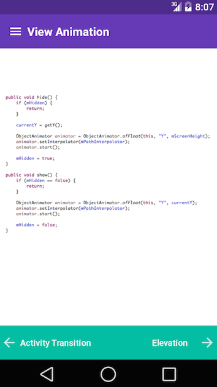

MaterialDesignSupport
=====================

Duplicate project to MaterialDesign, BUT meant for non Android L devices.

=====================

Android project that focuses on the new design and development opportunities and concepts with Material Design. It can be broken down into three sections.

1. Presentation slides on Material Design philosophy. (Slides attached: Principles - Material Design CoP)
2. Presentation slides on Material Design development. (Slides attached: Development Concepts - Material Design CoP)
3. Playground for implemented use of new Android L APIs.

Screen Shots
==============

